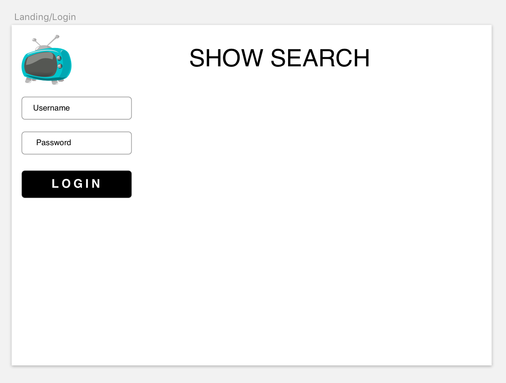
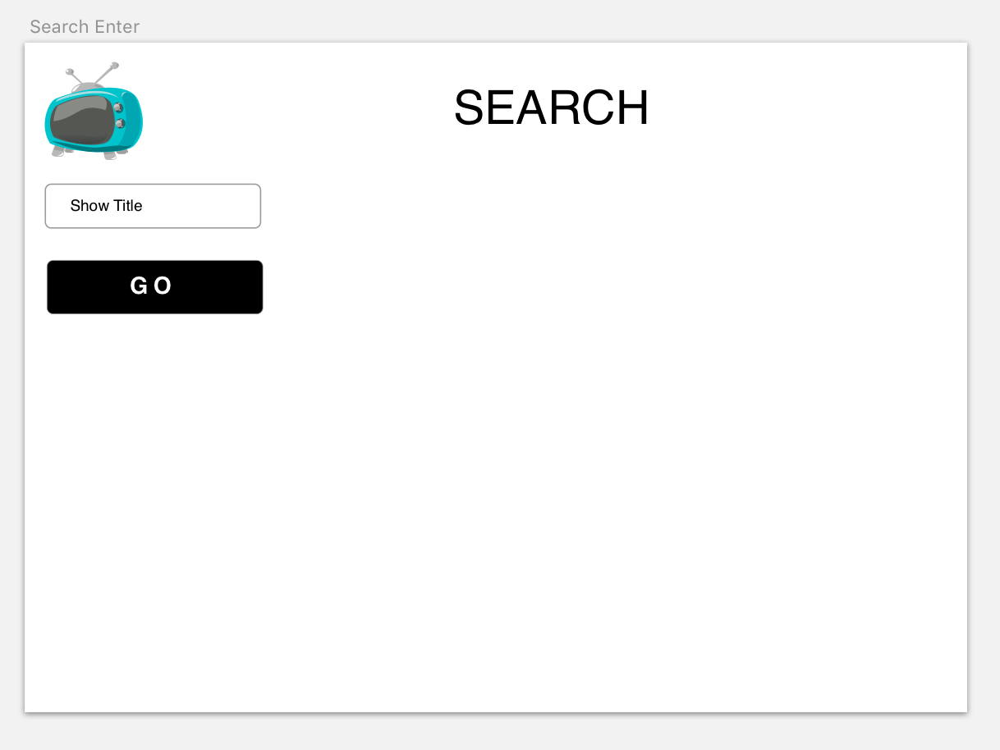
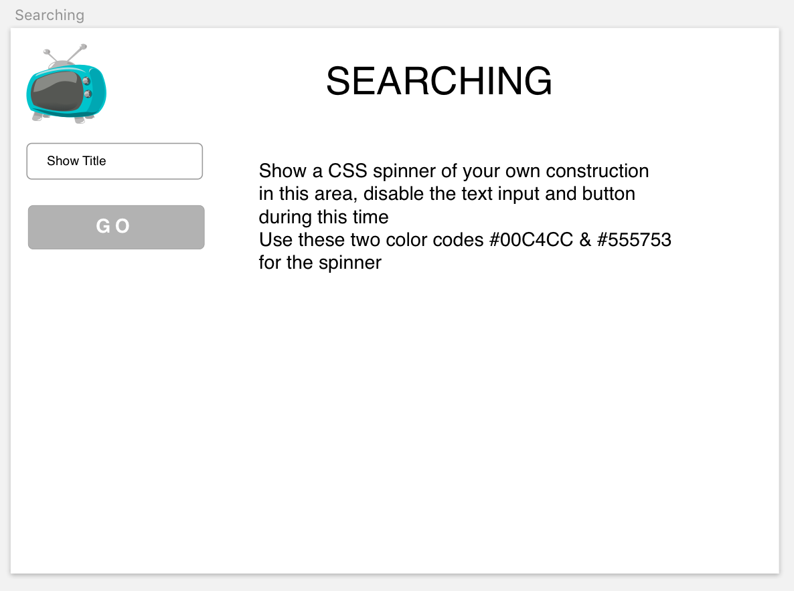
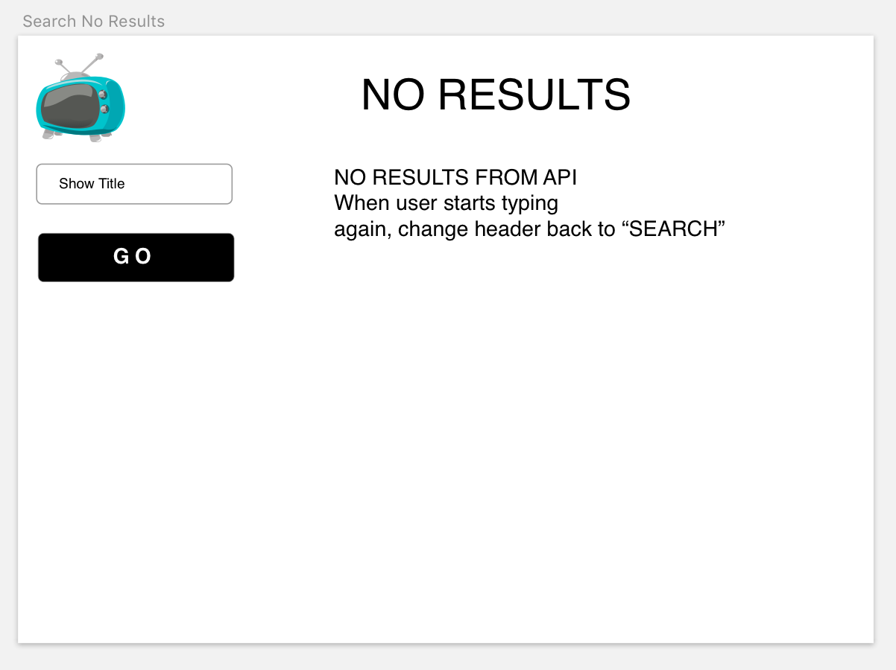
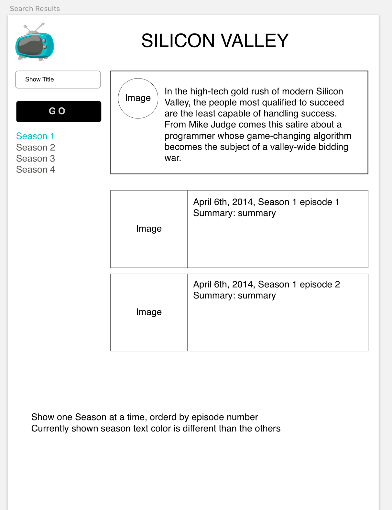

# React Web Coding Project


Run:
`yarn && yarn config:precommit`
to install dependencies and get started.

* Guidelines:

  * We feel we included all needed npm/yarn packages to complete this challenge.  If you feel you need another dependency, please reach out to us first so we can update our list and confirm our missing dependencies
  * Take as long as you want to complete this project, though it is designed for you to be able to complete it in a single day.  If this takes longer than one day to complete, don't worry about the all of the stretch goals.
  * Ask as many questions as you want


* Submission

  * Email us a .zip file with your completed code


* Basics:

  * Use Redux to hold show data, authorization status and API communication status'
  * Use Component state to hold entered text fields
  * Use `fetch` for network communications
  * The left side content with the form entries and button should be fixed along with the top Header.  The show content on `Screen-5` should scroll
  * Some usage of `Flow`


* Stretch (in order of preference):

  * Complete Flow-Type Redux reducers/actions
  * Use `async`/`await` wherever possible
  * Flow-Type React Components
  * Prop-Types validations

## Screen One, Login Page



* Hard code a password in Redux of `supersecret`

* Dim button opacity of button by 50% and disable click until entered password matches the value in Redux _and_ username is greater than or equal to 2 characters

* When login credentials are satisfied, set a value of `authorized` to `true` in Redux and use this `boolean` to disable unauthorized access on subsequent pages

## Screen Two, Enter Show Name



* Dim opacity of button by 50% and disable click until entered `showTitle` is greater than or equal to 2 characters

* The API we will hit when we press `GO` is `tvmaze`

* Here is a sample `GET` request:

```bash
https://api.tvmaze.com/singlesearch/shows?q=silicon-valley&embed=episodes
```

## Screen Three, Searching

* Show this screen while the API request is submitting and waiting for a response.

* Disable button while waiting for API response



## Screen Four, No Results

* Show this screen if we get no results from the API



## Screen Five, Results

* Show Title as the Header

* Show one season of the show at a time, ordered by episode number

* List seasons below `GO` button

* Currently shown season's text color is different than the non-shown seasons

* On-click of another season, re-populate the view the the correct data


